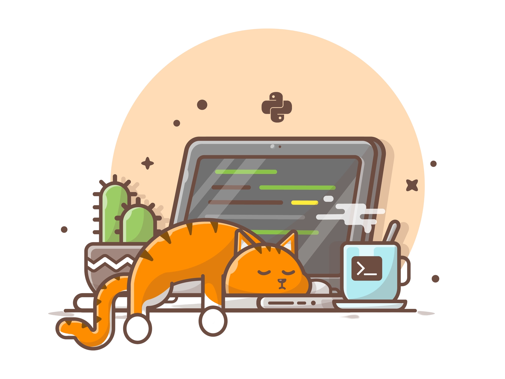

<p align="center">

</p>
<h1 align="center">
  PROJECT-L.A.Z.Y
</h1>

<p align="center">
  Be sure to ⭐ this repo so you can keep up to date on any daily progress!
</p>

<p align="center">
<a href="https://github.com/Abhijith14/PROJECT-L.A.Z.Y/" target="_blank">
    
</a>&nbsp;
<a href="https://www.python.org/" target="_blank">
    
</a>&nbsp;
<a href="https://github.com/Abhijith14/PROJECT-L.A.Z.Y" target="_blank">
    
</a>&nbsp;

</p>

<br>

## ⚡️ Quick start

First of all, download and install [Python](https://www.python.org/downloads/) and your favourite IDE (I used [PyCharm](https://www.jetbrains.com/pycharm/download/#section=windows)) and install the packages given in the **[requirements.txt](requirements.txt)** file. Python Version `3.6` or higher is required.

Package installation can be done by using the [`pip install`](https://www.geeksforgeeks.org/how-to-install-pip-on-windows/) command:

```bash
pip install -r requirements.txt
```
<br>

**Note** : It is recommended to create a virtual environment and install your packages inside the virtual environment

```bash
# Installing virtualenv
pip install virtualenv

# Creating virtual environment folder:
virtualenv venv


# Activating environment

# Windows
venv\Scripts\activate

# Finally installing packages inside environment
pip install -r requirements.txt
```

<br>

### 💻 Run Project L.A.Z.Y

Create your timetable as a *.xlsx* spreadsheet inside [timetable](TimeTable/) folder. After creating your timetable; run [start-class.py](start-class.py)

```bash
python start-class.py
```

> 🔔 Please note: This project uses several `windows OS` packages. Therefore this project works only in windows computers. In Future, other OS compatibility will be added.

<br>

## 🔧 Compatible with

- [x] Zoom
- [x] Google Classroom and Google Meet
- [ ] Microsoft Teams

<br>

## ⭐️ Project assistance

If you want to say **thank you** or/and support active development of `PROJECT-L.A.Z.Y`:

- Add a [GitHub Star](https://github.com/Abhijith14/Cowin-Scrape) to the project.
- Write interesting articles about project on [Dev.to](https://dev.to/), [Medium](https://medium.com/) or personal blog.

Together, we can make this project **better** every day! 😘

<br>

### 🛠️ Built With

* [Python 3.8](https://www.python.org/) - Creating Project


### ❤️ Authors

* **Abhijith Udayakumar** - *Design & Development* - [Abhijith14](https://github.com/Abhijith14)

<br>
<br>

## 🚨 Forking this repo (please read!)

_**yes, with attribution**_.

I value keeping my work open source, but as you all know, _**plagiarism is bad**_. It's always disheartening whenever I find that someone has copied my work without giving me credit. I spent a non-trivial amount of effort building and designing this project, and I am proud of it! All I ask of you all is to not claim this effort as your own.


### TL;DR

Yes, you can fork this repo. Please give me proper credit by linking back to [Abhijith14/PROJECT-L.A.Z.Y](https://github.com/Abhijith14/PROJECT-L.A.Z.Y). Thanks!
